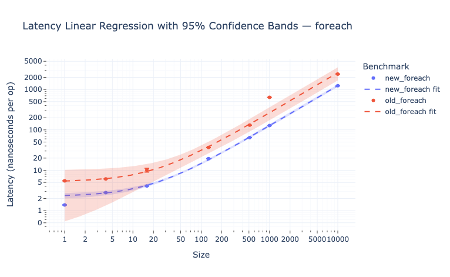
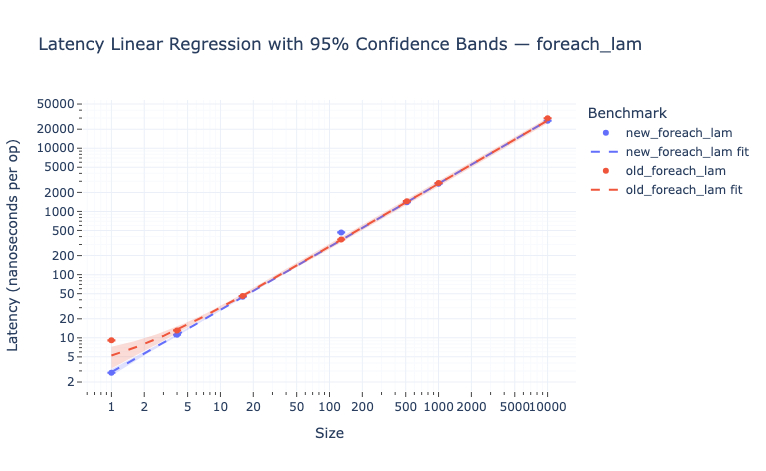
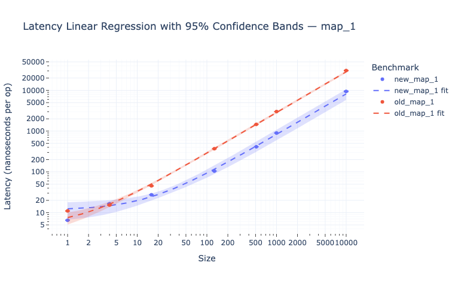
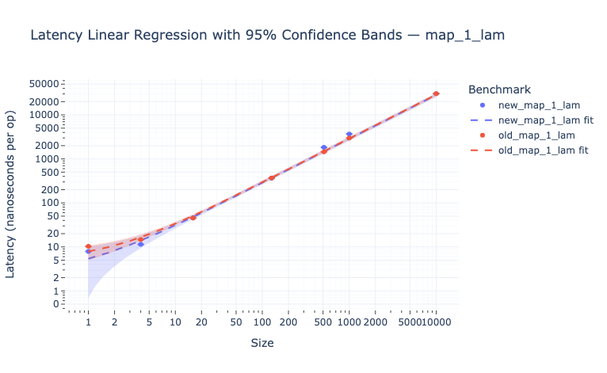
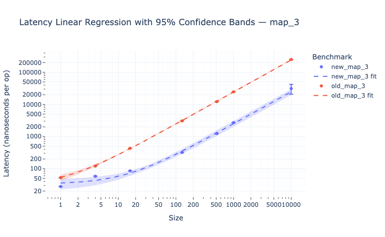

# Latency Regression Analysis of `foreach` and `map` Variants

This report presents a regression-based latency analysis of different implementations of array-processing methods in Scala (`map`, `foreach`).

We benchmark methods operating on `Array[Int]`:
- [`map`](https://github.com/2Pit/scala-benchmarks/blob/main/src/main/scala/benchmarks/Impl.scala#L7-L36)
- [`foreach`](https://github.com/2Pit/scala-benchmarks/blob/main/src/main/scala/benchmarks/Impl.scala#L38-L61)

The goal is to determine whether alternative loop implementations improve performance and whether these gains persist across call-site variants (e.g., direct function vs lambda).

---

## 🔬 Hypothesis

We hypothesize that the performance of `map` and `foreach` on primitive arrays depends on how the function is applied within the loop.

In particular:

- When the transformation function operates directly over `Array[Int]` with a simple loop, avoiding pattern-matching and casting, the implementation can remain tight and efficient.
- This should result in **lower per-element latency**, which can be measured by a **smaller slope** in the linear regression of total latency over array size.
- When the function is passed as a lambda (e.g., anonymous closure), performance benefits may vanish due to loss of compiler-level optimizations such as specialization or static dispatch.

This report compares multiple versions of `map` and `foreach` under these conditions and evaluates whether the differences are statistically significant.

---

## ⚙️ Benchmark Configuration

Benchmark settings are defined in the `Makefile` and were used consistently for all runs in this report. I executed the benchmarks manually via a dedicated GitHub Action.

The configuration was as follows:

```
FORKS := 1

SIZES_SHORT := 1,4,16,128,512
SIZES_LONG  := 1000,10000

WARMUP_ITER        := 4
WARMUP_TIME_SHORT  := 1s
WARMUP_TIME_LONG   := 2s

MEASURE_ITER       := 6
MEASURE_TIME_SHORT := 3s
MEASURE_TIME_LONG  := 20s
```

---

## 📊 `foreach` vs `foreach_lam`

| `foreach` | `foreach_lam` |
|-----------|---------------|
| <br>📈 [Interactive](../interactive/latency_foreach.html) | <br>📈 [Interactive](../interactive/latency_foreach_lam.html) |

```
new_foreach:     latency = (2.238 ± 0.139) + (0.124 ± 0.003) · size    [RMSE = 3.353 ns/op]
old_foreach:     latency = (5.146 ± 1.896) + (0.260 ± 0.036) · size    [RMSE = 160.237 ns/op]
Δslope = -0.1356, p = 0.0002 → significantly different? ✅ YES

new_foreach_lam: latency = (0.124 ± 0.147) + (2.743 ± 0.026) · size    [RMSE = 96.715 ns/op]
old_foreach_lam: latency = (2.518 ± 0.837) + (2.743 ± 0.101) · size    [RMSE = 872.760 ns/op]
Δslope = -0.0001, p = 0.9991 → significantly different? ❌ NO
```

**Conclusion**:
The `foreach` implementation shows a significant reduction in latency per element in the new version.
However, this effect disappears when a lambda is passed (`foreach_lam`), indicating that the compiler likely failed to inline or optimize the lambda-based variant.

---

## 📊 `map_1` vs `map_1_lam`

| `map_1` | `map_1_lam` |
|--------|-------------|
| <br>📈 [Interactive](../interactive/latency_map_1.html) | <br>📈 [Interactive](../interactive/latency_map_1_lam.html) |

```
new_map_1:       latency = (11.546 ± 2.261) + (0.817 ± 0.093) · size    [RMSE = 475.346 ns/op]
old_map_1:       latency = (4.717 ± 0.979) + (2.846 ± 0.067) · size    [RMSE = 789.208 ns/op]
Δslope = -2.0286, p = 0.0000 → significantly different? ✅ YES

new_map_1_lam:   latency = (2.566 ± 1.885) + (2.838 ± 0.121) · size    [RMSE = 812.102 ns/op]
old_map_1_lam:   latency = (4.985 ± 1.155) + (2.884 ± 0.086) · size    [RMSE = 573.207 ns/op]
Δslope = -0.0456, p = 0.7593 → significantly different? ❌ NO
```

**Conclusion**:
The `map_1` results show a clear performance benefit in the new version: the latency per element is in `3.5` times lower.
This effect is likely due to the fact that the new implementation allows the compiler to generate more efficient code when the transformation function has a known, concrete type (such as `Int => Int`).
In contrast, when a lambda is used (`map_1_lam`), the function is opaque to the compiler, and this optimization no longer applies — the slopes become nearly identical.

---

## 📊 `map_3` Comparison


📈 [Interactive version](../interactive/latency_map_3.html)

```
new_map_3:       latency = (32.980 ± 5.107) + (2.465 ± 0.198) · size    [RMSE = 2482.882 ns/op]
old_map_3:       latency = (29.161 ± 4.795) + (24.296 ± 0.336) · size    [RMSE = 2532.218 ns/op]
Δslope = -21.8314, p = 0.0000 → significantly different? ✅ YES
```

**Conclusion**:
The `map_3` benchmark applies three sequential map operations, each with a different transformation.
In the new version, the slope (latency per element) increases approximately threefold compared to `map_1`, which is expected given the triple application of map.
However, the old implementation shows a much steeper increase in latency, suggesting that its more complex internal logic scales worse when multiple transformations are chained.
This highlights that the simpler structure of the new implementation not only improves baseline performance, but also scales more predictably.

---

## 🧾 Summary Table

Each ratio below reflects the **latency per array element** in nanoseconds:
how many times slower the old version is compared to the new one.

| Variant         | Ratio (old / new) | p-value | Significant? |
|----------------|-------------------|---------|--------------|
| `foreach`       | 2.10              | 0.0002  | ✅ YES        |
| `foreach_lam`   | 1.00              | 0.9991  | ❌ NO         |
| `map_1`         | 3.48              | 0.0000  | ✅ YES        |
| `map_1_lam`     | 1.02              | 0.7593  | ❌ NO         |
| `map_3`         | 9.86              | 0.0000  | ✅ YES        |

---

## ✅ Conclusions

- The "new" implementations consistently demonstrate lower per-element latency compared to the original versions — **but only when the transformation function has a concrete, primitive-specific type**.
- This performance gain disappears when **lambdas are used**, as they prevent the compiler from selecting the most efficient code paths.
- In performance-sensitive contexts, prefer **direct method references** or **type-specialized functions** over generic lambdas.
- Additionally, the old implementation exhibits **less predictable scaling** when multiple transformations (e.g., chained `map` calls) are applied. Its internal structure appears to introduce increasing overhead that grows faster than linearly, unlike the simpler and more stable behavior of the new implementation.
